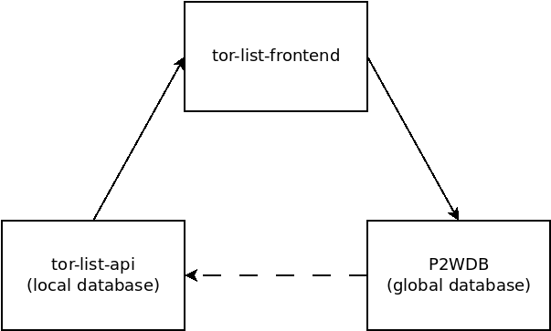

# Developer Documentation

This is living documentation that will be updated, edited, and changed over time, using the same version control as the rest of the code. The purpose of this documentation is to capture and explain the inner workings of the permissionless, censorship-resistant database driving [TorList.cash](https://torlist.cash).

# Overview

There are three major pieces of software behind the tor-list concept. They work together to form a censorship-resistant application for curating information about websites.

- [tor-list-frontend](https://github.com/Permissionless-Software-Foundation/tor-list-frontend) is the web based user interface (UI) which can be seen at [TorList.cash](https://torlist.cash/).
- [tor-list-api](https://github.com/Permissionless-Software-Foundation/tor-list-api) is the back end REST API that maintains a local database of information that tor-list-frontend reads from.
- P2WDB is the [pay-to-write-orbitdb](https://github.com/Permissionless-Software-Foundation/pay-to-write-orbitdb) REST API that infaces to the global peer-to-peer (p2p) database.

The arrows in the image represent the information flow between the three pieces of software:

- tor-list-frontend displays information about websites. It _reads_ this information from tor-list-api.
- tor-list-frontend is also a web wallet. It can generate the needed transactions to _write_ information to the P2WDB.
- tor-list-api imports data from the global database into its local database using [OrbitDB replication events](https://github.com/orbitdb/orbit-db/blob/main/GUIDE.md#replicating-a-database).

This architecture keeps the global database highly censorship resistant, while allowing local installations to maintain tight control over the user experience. The goal is to have many curation sites similar to [TorList.cash](https://torlist.cash). Each site would cater to their niche by customizing the display of the data, but they would all tap into the same global database of information.

**Example:** [TorList.cash](https://torlist.cash) will prevent the display of sites that are associated with drugs, guns, pornography, or gambling. That data can still exist in the global database, it just won't be displayed on Torlist.cash. Other websites, using a fork of the same software, can display those categories. They could also impose stricter rules to filter the data even more aggressively. Each site competes with the others for users, but work together to maintain the global database.

# Back End

This section provides additional information on the tor-list-api and P2WDB back end software.

## P2WDB

The heart of censorship resistance is the pay-to-write database (P2WDB). This is an [OrbitDB](https://orbitdb.org/) peer-to-peer (p2p) database. The write-access rules have been customized to allow anyone to write to the database, so long they prove that a sufficient quantity [PSF tokens](https://psfoundation.cash) have been burned, to pay for the write.

Because OrbitDB is a p2p database, no one party holds the 'official' copy of the database. Instead, like a blockchain, the database is replicated among several peers, and they coordinate updates to the database using consensus rules. Peers are free to leave or enter the network. Each peer independently verifies the database entries have sufficient proof-of-burn.

For more information, the code and documentation can be found in the [pay-to-write-orbitdb](https://github.com/Permissionless-Software-Foundation/pay-to-write-orbitdb) repository.

## tor-list-api

The [tor-list-api](https://github.com/Permissionless-Software-Foundation/tor-list-api) replicates a copy of the global P2WDB, but has the ability to apply localized filters to the data before passing it on to tor-list-frontend to be displayed. The most important filter is the `blacklist` model, which allows administrators of the site to mark database entries as 'blacklisted', to prevent them from being displayed.

tor-list-api is based on this [koa-api-boilerplate](https://github.com/christroutner/koa-api-boilerplate), which is a production ready REST API that includes many features for building a web app. This includes user management and authentication, REST API scaffolding, API documentation, Docker container generation, and extensive test coverage. It's intended to be customized for the needs of the website administrator.

# Workflows

This section describes the protocols for the database interactions between the three main software components.

## Writing to the Global Database

Adding data to the global P2WDB is a result of the interaction between tor-list-frontend and pay-to-write-orbitdb. tor-list-api is not involved.

Writing data follows these sets of steps:

- To add an entry to the global database, tor-list-frontend collects the data the user wants to add to the database, but it also collects several pieces of required information 'behind the scenes':
  - The users BCH address.
  - A cleartext message
  - A signature generated from the cleartext message and the BCH address.
  - It burns the required amount of PSF tokens, and generates a transaction ID (TXID) as proof of this burn.
- tor-list-frontend then communicates with P2WDB via its REST API to submit all the data.
- The P2WDB REST API will then evaluate the data and attempt to update the p2p database using the TXID as the proof to the other piers that the write is valid.
- Each peer on the network will independently validate the new database entry.
- The copy of OrbitDB in tor-list-api will receive a replication event. This event will trigger the import of the new data into the apps local Mongo database.

## Reading from the Local Database

tor-list-frontend reads data from the local database stored by tor-list-api, and does not read the global database directly. This gives tor-list-api the opportunity to filter and modify the data locally for a better user experience.

The most important filter that tor-list-api runs against the data is the blacklist filter. Entries in the OrbitDB are identified by a [CID](https://docs.ipfs.io/concepts/content-addressing/) or 'hash'. The blacklist filter is a collection of CIDs that have been 'blacklisted' for removal before being displayed on the front end. This allows the administrators of the website to prevent spam and abuse.

Entries on tor-list-frontend are organized relative to their [merit](https://github.com/Permissionless-Software-Foundation/bch-message-lib/blob/master/lib/merit.js). This merit value will change with time. Every 24 hours, the entries displayed at TorList.cash have their merit recalculated, and the merit value in the local database is updated.
