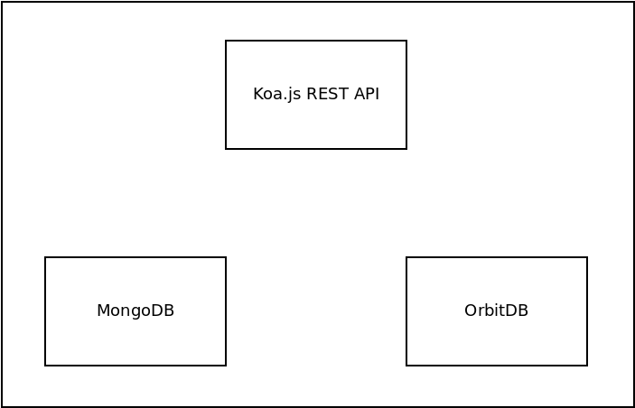

# Developer Documentation

This is living documentation that will be updated, edited, and change over time, using the same version control as the rest of the code. The purpose of this documentation is to capture and explain the inner workings of the permissionless, censorship-resistant database driving tor-list.

There are three major pieces of software behind the tor-list concept:

